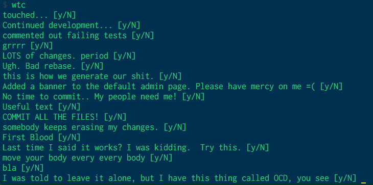

# Whatthecommiter

## Install

- `git clone git@github.com:jucke/whatthecommitter.git`
- place [`wtc`](bin/wtc) under /usr/local/bin directory
- use `chmod u+x wtc` to make it executable
- run it by typing `wtc` in the terminal

## What it does

Get a random commit message from [whatthecommit.com](http://whatthecommit.com) Type `y` to approve and commit with this message.

## How to use it

Run `wtc` to fetch a random message suggestion.

Type `y` to approve the message, it will run `git commit -m` with this message, i.e. `git commit -m "I forgot to commit... So here you go."` It doesn't stage files/execute any other git commands.

Type `n` (or just press `Enter`) to generate another commit message (doesn't do anything else, and doesn't run `git commit` until you approve a message). 

`Cmd+C` to quit.

## License

MIT © Jucke